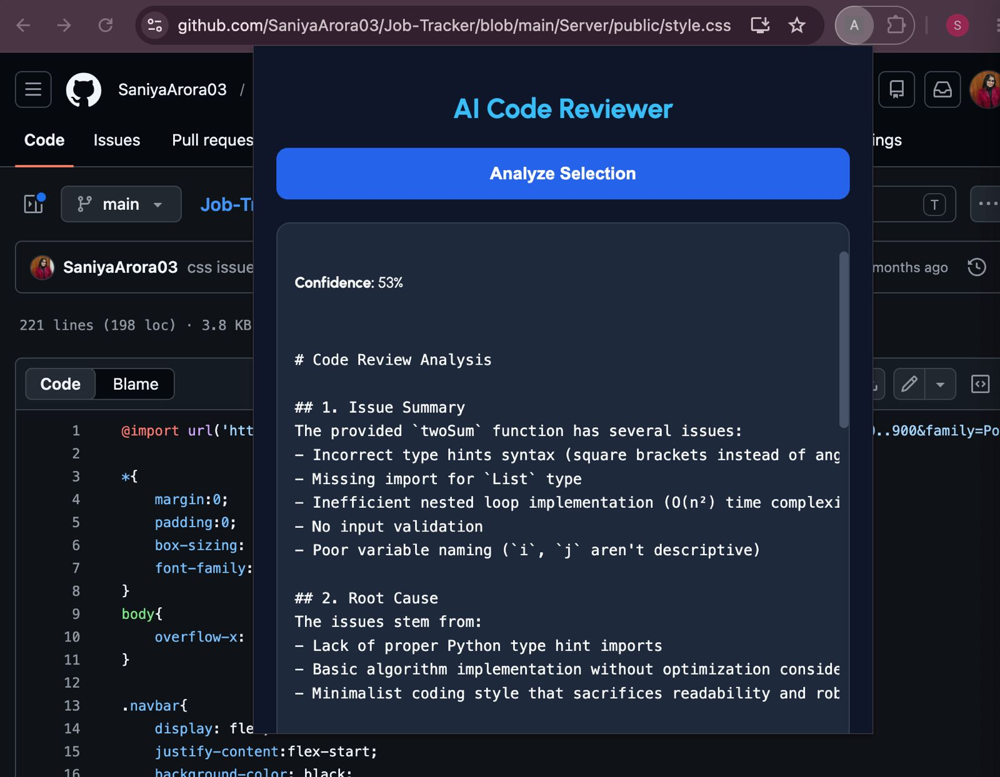

# AI Code Reviewer

## Overview

AI Code Reviewer is an end-to-end intelligent code analysis platform that combines **Machine Learning, Code Embeddings, Retrieval-Augmented Generation (RAG), and Large Language Models (LLMs)** to automatically review source code, identify potential defects, retrieve similar bug patterns, and generate detailed explanations with suggested fixes.

The system leverages **CodeBERT embeddings**, a **Random Forest classifier**, **FAISS vector search**, and **DeepSeek LLM** to provide context-aware code reviews through a React web application and Chrome browser extension.

---

## Key Highlights

* Automated AI-powered code review
* Defect prediction using Machine Learning
* Semantic code understanding with CodeBERT
* Retrieval-Augmented Generation (RAG)
* Similar bug pattern search using FAISS
* AI-generated explanations and code fixes
* React frontend and FastAPI backend
* Chrome Extension integration
* End-to-end ML + RAG + LLM pipeline

---

## System Architecture

```text
User Code
    │
    ▼
CodeBERT Embeddings
    │
    ▼
Embedding Vector
    │
    ├──────────────► Random Forest Classifier
    │                       │
    │                       ▼
    │                Defect Prediction
    │
    ▼
FAISS Vector Database
    │
    ▼
Similar Bug Retrieval
    │
    ▼
Prompt Construction
    │
    ▼
DeepSeek LLM (OpenRouter)
    │
    ▼
AI Review Report
```

---

## Technical Specifications

### Machine Learning

* Random Forest Classifier
* Scikit-Learn
* Defect Detection Model
* Probability-based Confidence Scoring

### Deep Learning

* Microsoft CodeBERT
* Hugging Face Transformers
* 768-Dimensional Semantic Code Embeddings

### Retrieval-Augmented Generation (RAG)

* FAISS Vector Database
* Similar Bug Retrieval
* Context-Aware Prompt Augmentation

### Large Language Model

* DeepSeek V3
* OpenRouter API Integration
* Automated Code Explanation & Fix Generation

### Backend

* FastAPI
* Uvicorn
* REST APIs
* JSON Response Pipeline

### Frontend

* React
* Axios


### Browser Extension

* Chrome Extension (Manifest V3)
* Context Menu Integration
* Real-Time Code Review

---

## Dataset

**CodeXGLUE Defect Detection Dataset**

Used for:

* Defect Classification
* Embedding Generation
* Similar Bug Retrieval
* Model Training & Evaluation

---

## Workflow

### 1. Code Submission

Users submit code through:

* React Web Application
* Chrome Browser Extension

### 2. Semantic Embedding Generation

The submitted code is converted into a dense semantic representation using CodeBERT.

### 3. Defect Prediction

The embedding vector is passed to a Random Forest model which predicts whether the code is potentially defective.

### 4. Similar Bug Retrieval

FAISS performs vector similarity search to retrieve semantically similar code snippets from the indexed dataset.

### 5. AI Review Generation

The following information is combined:

* User Code
* Defect Prediction
* Similar Retrieved Examples

and sent to DeepSeek for analysis.

### 6. Review Delivery

The system generates:

* Issue Summary
* Root Cause Analysis
* Severity Assessment
* Suggested Improvements
* Corrected Code
* Best Practices

---

## Tech Stack

| Layer             | Technology                  |
| ----------------- | --------------------------- |
| Language          | Python, JavaScript          |
| ML                | Scikit-Learn, Random Forest |
| Embeddings        | CodeBERT                    |
| Vector Search     | FAISS                       |
| LLM               | DeepSeek V3                 |
| API               | OpenRouter                  |
| Backend           | FastAPI                     |
| Frontend          | React                       |
| Browser Extension | Chrome Extension            |
| Dataset           | CodeXGLUE                   |

---

## Running the Project

### Backend

```bash
uvicorn backend.main:app --reload
```

### Frontend

```bash
cd frontend
npm install
npm run dev
```

---

## Future Enhancements

* Multi-class bug categorization
* Security vulnerability detection
* Automated code refactoring suggestions
* Support for multiple programming languages
* VS Code extension integration
* Fine-tuned CodeBERT classifier

---

## Project Impact

This project demonstrates practical experience with:

* Machine Learning
* Deep Learning
* Retrieval-Augmented Generation (RAG)
* Vector Databases
* Large Language Models
* Full-Stack Development
* Browser Extension Development
* API Design & Integration

making it a strong portfolio project for Software Engineering, AI/ML Engineering, and Generative AI roles.
